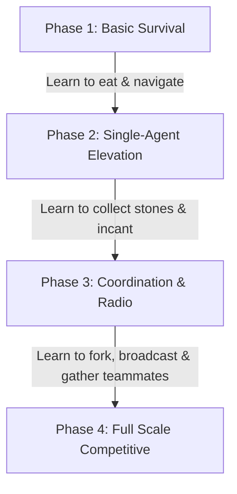

# Zappy AI Training Log & Roadmap

This file acts as a lab notebook to document the parameter tweaks, learning curves, and results of training runs.

> [!NOTE]
> **Training vs. Evaluation Settings**:
> Under the hood, the library training environment (`LibZappyEnv`) dynamically randomizes the map size, team count, and players per team on every reset. This "Domain Randomization" prevents overfitting and teaches the AI general skills.
> The parameters listed below (like **Map Size** and **Configuration**) represent the **target settings we use during evaluation** (via `evaluate_ai.py`) to measure if the phase was successful.

---

## AI Training Roadmap



### Phase 1: Basic Survival & Navigation
* **Objective**: Teach the neural network to walk, search the map, check its inventory, and consume food when hungry. It must learn not to starve.
* **Map Size**: `10x10`
* **Configuration**: `total_teams=1`, `frequency=1000`
* **Expected Result**: Survives average of 10,000+ turns, remains Level 1.
* **Timesteps**: `200,000`
* **Target Model Name**: `zappy_survival_v1`

### Phase 2: Single-Agent Elevation (Level 2 Competence)
* **Objective**: Train the agent to search for Linemate stones, drop them on a tile, and execute the `Incantation` command to elevate itself to Level 2.
* **Map Size**: `12x12`
* **Configuration**: Load `zappy_survival_v1`, `total_teams=1`, `frequency=1000`
* **Expected Result**: Reaches Level 2 consistently.
* **Timesteps**: `300,000` (Cumulative: `500,000`)
* **Target Model Name**: `zappy_level2_v1`

### Phase 3: Coordination & Radio Broadcasts (Level 3-4 Competence)
* **Objective**: Level 3 requires multiple players. Agents must learn to use `FORK` to spawn teammates, `BROADCAST` messages to coordinate, and navigate towards teammate coordinates when an incantation is initiated.
* **Map Size**: `15x15`
* **Configuration**: Load `zappy_level2_v1`, `total_teams=1` (with 2 players), `frequency=1000`
* **Expected Result**: Reaches Level 3/4.
* **Timesteps**: `500,000` (Cumulative: `1,000,000`)
* **Target Model Name**: `zappy_coordination_v1`

### Phase 4: Competitive Multi-Team Play (Level 5-8 Competence)
* **Objective**: Train in the presence of rival teams. Learn to manage resource scarcity, handle ejection, and optimize team-wide ascension to Level 8.
* **Map Size**: `20x20`
* **Configuration**: Load `zappy_coordination_v1`, `total_teams=2` (each with 2-3 players), `frequency=1000`
* **Expected Result**: Master coordination, reaching Level 5+ consistently.
* **Timesteps**: `1,000,000` (Cumulative: `2,000,000`)
* **Target Model Name**: `zappy_master_v1`

---

##  Experiment Log

template to document each training run.

(start of template)
### Run #[Number]
- **Base Model**: `[Fresh / Loaded from <model_name>]`
- **Output Model Name**: `[e.g. zappy_survival_v1]`
- **Timesteps Run**: `[e.g., 200,000]`
- **Real-World Duration**: `[e.g., 8 minutes]`

#### Parameters
```bash
# Paste the exact run command here:
./ai/training/run_training.sh -t 200000 -f 1000 -n TeamAI -m zappy_survival_v1
```

#### Evaluation Metrics (via evaluate_ai.py)
```
# Run (adjust --teams, --players, --width, --height depending on phase):
PYTHONPATH=ai python ai/training/training_env/evaluate_ai.py --model zappy_survival_v1 --teams team01 --players 1 --width 10 --height 10
```
- **Average Level Achieved**: `X.XX`
- **Max Level Achieved**: `X`
- **Average Turns Survived**: `XXXX`
- **Rating Tier**: `[Tier 1 / Tier 2 / ...]`

#### Observations (when running game with gui)
- *What actions did the agent prioritize?*
- *Did it exhibit any loop behaviors or stuck states?*
- *Adjustments needed for the next run:*

(end of template)

### Run #1
- **Base Model**: `Fresh`
- **Output Model Name**: `zappy_survival_v1`
- **Timesteps Run**: `200,000`
- **Real-World Duration**: `1m 50s`

#### Parameters
```bash
# Paste the exact run command here:
./run_training.sh -t 200000 -f 1000 -m zappy_survival_v1
```

#### Evaluation Metrics (via evaluate_ai.py)
Run: 
```
PYTHONPATH=ai python ai/training/training_env/evaluate_ai.py --model zappy_survival_v1 --teams team01 --players 1 --width 10 --height 10
```
- **Average Level Achieved**: `1.10`
- **Max Level Achieved**: `2`
- **Average Turns Survived**: `41.00`
- **Max Turns Survived**: `85`
- **Rating Tier**: `Tier 1 Starvation/Survival Failure`

#### Observations (when running game with gui)
- *What actions did the agent prioritize?*
  - The player would not take any stones from the ground
  - The player manage to evolve to level 2 when the stone needed was already on the tile and he AI's random exploration chooses the Incantation action. 
  - Player would ignore food on the tiles unless it's life bar fell bellow a certain mark
- *Did it exhibit any loop behaviors or stuck states?*
  - Player would only walk forward. This can be explained by the fact that in level 1 the player can only look one tile ahead, because in this phase the AI is not  
- *Adjustments needed for the next run:*
  - Phase 1 is complete and successful. The agent has mastered basic survival and hunger control. 
  - In Phase 2, we introduce stones needed for elevation, which award a massive +4.0 points (compared to the tiny +0.1 for walking forward). The agent will quickly learn that it cannot get these high rewards by just walking in a straight line; it will be forced to turn, look, and steer towards the stones.
