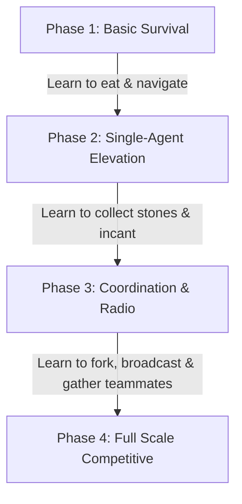

# Zappy AI Training Roadmap

> [!NOTE]
> **Training vs. Evaluation Settings**:
> Under the hood, the library training environment (`LibZappyEnv`) dynamically randomizes the map size, team count, and players per team on every reset. This "Domain Randomization" prevents overfitting and teaches the AI general skills.
> The parameters listed below (like **Map Size** and **Configuration**) represent the **target settings we use during evaluation** (via `evaluate_ai.py`) to measure if the phase was successful.

---

## AI Training Roadmap

### Phase 1: Basic Survival & Navigation
* **Objective**: Teach the neural network to walk, search the map, check its inventory, and consume food when hungry. It must learn not to starve.
* **Map Size**: `10x10`
* **Configuration**: `total_teams=1`, `frequency=1000`
* **Expected Result**: Survives average of 10,000+ turns, remains Level 1.
* **Timesteps**: `200,000`
* **Target Model Name**: `zappy_survival_v1`

### Phase 2: Single-Agent Elevation (Level 2 Competence)
* **Objective**: Train the agent to search for Linemate stones, drop them on a tile, and execute the `Incantation` command to elevate itself to Level 2.
* **Map Size**: `12x12`
* **Configuration**: Load `zappy_survival_v1`, `total_teams=1`, `frequency=1000`
* **Expected Result**: Reaches Level 2 consistently.
* **Timesteps**: `300,000`
* **Target Model Name**: `zappy_level2_v1`

### Phase 3: Coordination & Radio Broadcasts (Level 3-4 Competence)
* **Objective**: Level 3 requires multiple players. Agents must learn to use `FORK` to spawn teammates, `BROADCAST` messages to coordinate, and navigate towards teammate coordinates when an incantation is initiated.
* **Map Size**: `15x15`
* **Configuration**: Load `zappy_level2_v1`, `total_teams=1` (with 2 players), `frequency=1000`
* **Expected Result**: Reaches Level 3/4.
* **Timesteps**: `500,000`
* **Target Model Name**: `zappy_coordination_v1`

### Phase 4: Competitive Multi-Team Play (Level 5-8 Competence)
* **Objective**: Train in the presence of rival teams. Learn to manage resource scarcity, handle ejection, and optimize team-wide ascension to Level 8.
* **Map Size**: `20x20`
* **Configuration**: Load `zappy_coordination_v1`, `total_teams=2` (each with 2-3 players), `frequency=1000`
* **Expected Result**: Master coordination, reaching Level 5+ consistently.
* **Timesteps**: `1,000,000`
* **Target Model Name**: `zappy_master_v1`
